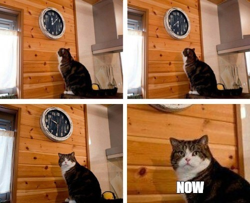

# Gender Equality in Speed Dating

Typically, during speed dating, boys move from table to table, while girls sit. Is this fair? Maybe. But let's consider a problem of organizing 
"equal rights" speed dating, in which each participant can interact with any 
other participant of the opposite gender and visit every table. This article 
explains how to organize such speed dating and how the CP-Sat solver can be 
useful in solving this problem.

**Disclaimer!** The problem is of theoretical interest, and its solution is not 
recommended for practical use.

<!-- more -->

A moment comes in almost every man's life when he decides it is time to get married.

<figure markdown="span">
  
</figure>

Those who already have a girlfriend are lucky. Those who don't have it have a harder time. One way to meet a girl is to go speed dating. These dates proceed as follows: \(n\) boys and \(n\) girls meet at cafe in the evening. The tables in the cafe are numbered from \(1\) to \(n.\) Each girl chooses a table and sits at it the whole evening. Different girls sit at different tables. At the beginning of the evening, the boys randomly sit at the tables. Of course, different boys sit at different tables. The dating consists of \(n\) rounds, each lasting 5 minutes. At the end of each round, every boy moves to the table with the number one greater than the current one (the boy sitting at table \(n\) moves to table \(1\)). After all the rounds, each boy and each girl will get to know each other. Each participant then fills out a questionnaire indicating which participant of 
the opposite gender they found attractive. In the case of mutual interest, the 
boy and the girl receive each other's contact information.

From the description, it seems like boy put a little more effort on speed dating. 
I'm from Belarus and it's not surprising to me that boys and girls have different 
roles in building relationships. But the question naturally arises: is it 
possible to organize speed dating so that guys and girls participate equally?

By a fortunate coincidence, I was recently solving the following problem with my 
students:

**Problem 1.** *There are \(n\) boys, \(n\) girls and \(n\) numbered tables in 
a restaurant. One boy and one girl sit at each table. On each table it is 
written which table the boy sitting at it should move to and which table the 
girl sitting at it should move to. Every five minutes, all boys and girls move 
according to the numbers indicated on their tables. For which \(n\) one can 
write the numbers on the tables such that every boy eventually meets every 
girl, and every participant sits at every table?*

The situation described in the problem is very similar to speed dating, so let's 
solve this problem. Assume that for a given \(n,\) the numbers can be written on 
the tables as required in the problem. Let's consider the initial seating 
arrangement of the boys and girls at the tables. Choose an arbitrary table. Let 
the boy and girl sitting there be \(B_{0}\) and \(G_{0},\) respectively. Let 
\(T_{1}, T_{2}, \ldots, T_{n-1}\) be the tables that boy \(B_{0}\) sequentially 
visits after table \(T_{0}.\) Finally, for each \(i\) from 1 to \(n-1,\) let 
\(B_{i}\) and \(G_{i}\) be the boy and girl who initially sat at table \(T_{i},\) 
respectively. Thus, for any \(i\) from \(0\) to \(n-1\) and any \(j\) from \(0\) 
to \(n-1,\) boy \(B_{i}\) will be sitting at table \(T_{(i+j)\%n}\) during round 
\(j,\) where \(m\% n\) means the remainder when dividing \(m\) by \(n.\) To 
simplify the notation, we will number the boys, girls, and tables modulo \(n,\) 
and in particular, we will write \(T_{i+j}\) instead of \(T_{(i+j)\%n}.\)

Before continuing the solution to **Problem 1** in its general form, let's 
consider a few specific cases. These cases will allow us to become familiar with
the introduced notation. For \(n=2,\) the desired way of moving does not 
exist. Indeed, after round 0, boy \(B_{0}\) and girl \(G_{0}\) must move to 
table \(T_{1},\) meaning they will meet again.

**Round 0:**

{ width="500" }

**Round 1:**

{ width="500" }

However, for \(n=3,\) the desired way of moving does exist.

**Round 0:**


**Round 1:**


**Round 2:**


Let's return to solving the problem. By \(T_{x_{0}}, T_{x_{1}}, \ldots, 
T_{x_{n-1}}\) we denote the tables that girl \(G_{0}\) sequentially visits, 
where \(x_{0}, x_{1}, \ldots, x_{n-1}\) is some permutation of the numbers 
\(0, 1, \ldots, n-1\) such that \(x_{0}=0.\) Then girl \(G_{x_{i}}\) 
sequentially visits tables \(T_{x_{i}}, T_{x_{i+1}}, \ldots, T_{x_{i-1}}.\) 
Consequently, during round \(j,\) girl \(G_{x_{i}}\) will be sitting at table 
\(T_{x_{i+j}}.\) The boy sitting at this table at that moment will be 
\(B_{x_{i+j}-j}.\) Since girl \(G_{x_{i}}\) must interact with all boys, for any 
\(i,\) the set of numbers \(x_{i+0}-0, x_{i+1}-1, \ldots, x_{i+n-1}-(n-1)\) must 
form a complete residue system modulo \(n.\) Since every such set is obtained 
from the set of numbers \(x_{0}-0, x_{1} - 1, \ldots, x_{n-1} - (n-1)\) by 
adding \(i\) to each of its members, it is necessary and sufficient that only 
the set \(x_{0}-0, x_{1} - 1, \ldots, x_{n-1} - (n-1)\) forms a complete residue 
system modulo \(n.\) Thus, **Problem 1** is reduced to the following problem.

**Problem 2.** *Find all natural numbers \(n\) for which there exists a 
permutation \(x_{0}, x_{1}, \ldots, x_{n-1}\) of the numbers \(0, 1, \ldots, n-1\) 
such that the numbers \(x_{0}-0, x_{1} - 1, \ldots, x_{n-1} - (n-1)\) form a 
complete residue system modulo \(n.\)*

Before solving **Problem 2**, let's use the CP-Sat solver to check if the 
desired permutation exists for specific values of \(n.\) Using the solver often 
helps to formulate a correct hypothesis about the answer.

```py linenums="1"
from ortools.sat.python import cp_model

def solve(n: int):
    model = cp_model.CpModel()
    xs = [model.new_int_var(0, n - 1, '') for _ in range(n)]
    model.add_all_different(xs)
    ys = [model.new_int_var(0, n - 1, '') for _ in range(n)]
    model.add_all_different(ys)
    for i, (x, y) in enumerate(zip(xs, ys)):
        b = model.new_bool_var('')
        model.add(x - i == y - n * b)
    solver = cp_model.CpSolver()
    status = solver.solve(model)
    print(solver.status_name(status))
````

The code above is quite simple. The only non-trivial part is the use of the 
auxiliary binary variable `b` in each equation of the form `x - i == y - n * b`. 
This trick allowed us to use the built-in `all_different` constraint for the 
array of variables `ys`.

Calling the function `solve` for \(n\) from \(1\) to \(10,\) we find that the 
desired permutation of numbers exists only for odd \(n.\) This suggests that the 
answer to **Problem 2** is the set of all odd numbers. Let's prove the 
formulated hypothesis. Consider the sum

\[
s = (x_{0}-0)+(x_{1} - 1)+\ldots+\bigl(x_{n-1} - (n-1)\bigr).
\]

Since \(x_{0}, x_{1}, \ldots, x_{n-1}\) is a permutation of the numbers from 
\(0\) to \(n-1,\), it follows that

\[
s=x_{0}+x_{1}+\ldots+x_{n-1}-(0+1+\ldots+n-1) = 0.
\]

Since the numbers \(x_{0}-0, x_{1} - 1, \ldots, x_{n-1} - (n-1)\) form a 
complete residue system modulo \(n,\), it follows that

\[
s\equiv 0+1+\ldots+n-1=\dfrac{n(n-1)}{2}\;(\mathrm{mod}\, n).
\]

Consequently, the number \(\dfrac{n(n-1)}{2}\) must be divisible by \(n.\) If 
\(n\) is even, the exponent of \(2\) in \(\dfrac{n(n-1)}{2}\) is less than in 
\(n.\) Therefore, the number \(n\) must be odd.

For any odd \(n,\) the required permutation \(x_{0}, x_{1}, \ldots, x_{n-1}\) is 
easy to construct. Let \(x_{i}\equiv -i\;(\mathrm{mod}\, n)\) for all \(i\) from 
\(0\) to \(n-1.\) Then the numbers 
\(x_{0}-0\equiv_{n} -2\cdot 0, x_{1}-1\equiv_{n} -2\cdot 1, \ldots, x_{n-1}-(n-1)\equiv_{n} -2\cdot (n-1)\) form a complete residue system modulo \(n,\) since \(n\) and \(2\) are coprime. 
**Problem 2** is solved.

Thus, only for odd \(n\) can the numbers be written on the tables as required in 
**Problem 1**. In this case, at the end of each round, it is sufficient for 
every boy to move to the table with a number one greater than the current one, 
and for every girl to move to the table with a number one less than the current 
one. **Problem 1** is solved.

The question remains: what should be done if an even number of boys/girls
attends speed dating? In this case, the organizers can add a virtual table, 
initially occupied by a virtual boy and girl, and proceed as if there are an odd 
number of boys/girls. According to this decision, every real participant will 
have one five-minute break during the speed dating. During this break, the 
participant can take a rest from chating and, for example, visit the restroom 
without a long queue.