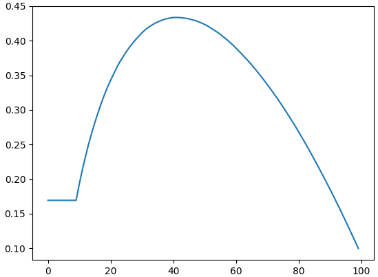

# Generalization of the Secretary Problem

*In the classic Secretary Problem, every "no" is final. But how realistic is that? In reality, we almost always have an opportunity to change our minds and return to a recent candidate. In this post, we will relax this strict rule and see how the selection strategy changes if we have the possibility to return to a few previous options.*

<!-- more -->

Let's imagine you're selecting a new employee under the following conditions:

1. The total number of candidates \(n\) is known in advance;
2. All candidates have different skill levels;
3. You interview candidates one by one in a random order;
4. You can either hire the current candidate or reject him forever;
5. You need to select the best candidate.

It is clear that no matter what you do, you cannot guarantee selecting the best candidate. You need to devise a strategy that has the highest probability of selecting the best candidate.

This is a well-known problem called the Secretary Problem. The optimal strategy is to reject the first \(\approx n/e\) candidates to evaluate their skills, and then hire the first person who is better than everyone you have seen before.

<figure markdown="span">
  { width="400" }
</figure>

We rarely encounter the impossibility of returning. So let's change the problem: now you can choose not only the current candidate, but also any of the \(m<n\) most recently interviewed candidates. The Secretary Problem is a special case of this problem when \(m=1\).

Let's denote the candidates by \(C_{0},\) \(C_{1},\) \(\ldots,\) \(C_{n-1}.\) Suppose you've already conducted \(i\) interviews. If \(i<m\) or candidate \(C_{i-m}\) is not the best among the first \(i\) candidates, then you can safely move on to interviewing the next candidate \(C_{i}\) without worrying about missing out on the best candidate.
If \(i\geq m\) and candidate \(C_{i-m}\) is the best among all the first \(i\) candidates, then there is a non-zero probability that candidate \(C_{i-m}\) is the best among all candidates. Therefore, you must decide whether to stop now. There are \(n\) strategies \(S_{0},\) \(S_{1},\) \(\ldots,\) \(S_{n-1}\). Strategy \(S_{j}\) is to hire candidate \(C_{i-m}\) if he is the best among the first \(i\) candidates and \(i\geq j\). For all of these strategies we assume that if you conduct all \(n\) interviews and the best candidate is among the last \(m\) candidates, then you hire him.

By \(p_{j}\) we denote the probability of choosing the best candidate if you use strategy \(S_{j}.\) If the probabilities \(p_{0},\) \(p_{1},\) \(\ldots,\) \(p_{n-1}\) were known, then you should act according to strategy \(S_{j^{\star}},\) for which the probability of success \(p_{j^{\star}}\) is highest. Unfortunately, it is quite difficult to calculate these probabilities precisely, so we will estimate them using the Monte Carlo method.

By \(L_{0},\) \(L_{1}\), \(\ldots,\) \(L_{n-1}\) we denote the levels of candidates \(C_{0},\) \(C_{1},\) \(\ldots,\) \(C_{n-1}\), respectively. Without loss of generality, we assume that \(L_{0},\) \(L_{1}\), \(\ldots,\) \(L_{n-1}\) is a permutation of integers from \(0\) to \(n-1\). For each sequence \(L_{0},\) \(L_{1}\), \(\ldots,\) \(L_{n-1}\), it is necessary to find the winning strategies. By `indices[i]` we denote the index of the largest number among \(L_{0},\) \(L_{1}\), \(\ldots,\) \(L_{i}\) (\(i\) ranges from \(0\) to \(n-1\)). All values of the array `indices` can be found in \(O(n).\) Using this array, we find the indices `beg`, `beg+1`, ..., `end-1` of winning strategies in the following way.

```cpp
std::pair<int, int> find_winning_strategies(
  const std::vector<int> &indices, int m)
{
  const auto n = (int)indices.size();
  auto index = indices[n - 1];
  const auto end = std::min(index + m, n);
  while (index > 0) {
    auto next_index = indices[index - 1];
    if (auto beg = next_index + m; beg <= index) {
      return std::pair{beg, end};
    }
    index = next_index;
  }
  return std::pair{0, end};
}
```

Finally, we find the estimates \(\bar{p}_{0},\) \(\bar{p}_{1},\) \(\ldots,\) \(\bar{p}_{n-1}\) of the probabilities \(p_{0},\) \(p_{1},\) \(\ldots,\) \(p_{n-1}\).

```cpp
std::vector<double> estimate(int n, int m, int num_tests)
{
  std::vector<double> result(n);
  std::vector<int> permutation(n);
  std::iota(permutation.begin(), permutation.end(), 0);
  std::random_device rd;
  std::mt19937 g(rd());
  std::vector<int> indices(n);
  for (auto i = 0; i < num_tests; ++i) {
    std::shuffle(permutation.begin(), permutation.end(), g);
    int index = 0;
    indices[0] = 0;
    int max_value = permutation[0];
    for (auto j = 1; j < n; ++j) {
      if (permutation[j] > max_value) {
        index = j;
        max_value = permutation[j];
      }
      indices[j] = index;
    }
    const auto [beg, end] = find_winning_strategies(indices, m);
    for (auto j = beg; j < end; ++j) {
      ++result[j];
    }
  }
  for (auto i = 0; i < n; ++i) {
    result[i] /= num_tests;
  }
  return result;
}
```

For the classical Secretary Problem, the formulas for calculating the required probabilities are known:

\[
p_{0}=\frac{1}{n}\quad\text{and}\quad p_{i}=\frac{i}{n}\sum_{k=i}^{n-1}\frac{1}{k}\quad\text{for}\; i\in\{1,2,\ldots,n-1\}.
\]

Let's estimate these probabilities by calling `estimate(100, 1, 1000000)`. Direct calculations show that

\[
  \max\limits_{0\leq i\leq n-1}|\bar{p}_{i}-p_{i}|\leq 10^{-3}.
\]

Finally, let's consider a more interesting case \(m = 10\),
i.e., when you can choose any of the last \(10\) candidates.
The plot of the probability estimates is presented below.

<figure markdown="span">
  
</figure>

In this case, the best strategy is \(S_{41}\) with a probability of success 
\(p_{41}\approx 0.43.\)


